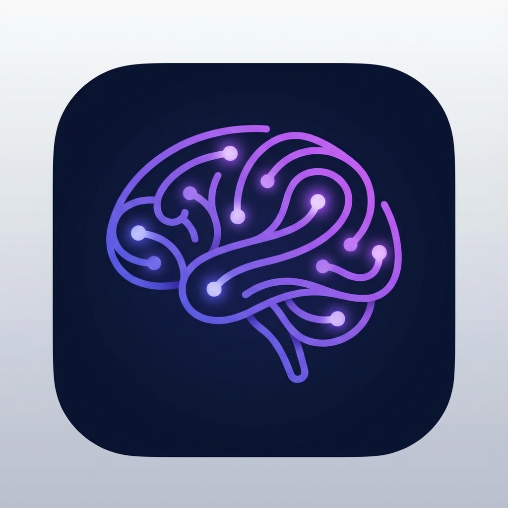

# KaiROS AI

<p align="center">
  
</p>

<p align="center">
  <b>A powerful local AI assistant for Windows</b><br>
  Run LLMs locally with GPU acceleration • No cloud required • Privacy-first
</p>

<p align="center">
  <a href="https://github.com/avikeid2007/Kairos.local/releases/latest"></a>
  
  
  
  
</p>

---

## 📥 Download

<p align="center">
  <a href="https://github.com/avikeid2007/Kairos.local/releases/latest">
    
  </a>
  
</p>

- **[Download Latest Release](https://github.com/avikeid2007/Kairos.local/releases/latest)** - Self-contained Windows installer
- **Microsoft Store** - 🔜 Coming Soon!
- No .NET installation required
- Supports Windows 10/11 (x64)

---

## ✨ Features

### Core

- 🤖 **Run LLMs Locally** - No internet required after model download
- 🚀 **GPU Acceleration** - CUDA 12 support for NVIDIA GPUs (RTX 50/40/30/20 series)
- 📦 **Model Catalog** - 31 pre-configured models from 9 organizations
- ⬇️ **Download Manager** - Pause, resume, and manage model downloads
- 💬 **Chat Interface** - Clean, modern UI with streaming responses
- 📊 **Performance Stats** - Real-time tokens/sec and memory usage

### Model Catalog

- 🏢 **Organization Sections** - Collapsible groups for Qwen, Google, Meta, Microsoft, and more
- 🔍 **Advanced Filtering** - Filter by Organization, Family, Variant (CPU-Only, GPU-Recommended)
- ⬇️ **Downloaded Models** - Quick access section at the top
- 🏷️ **Visual Badges** - Category, family, variant, and download status indicators
- ➕ **Custom Models** - Add your own GGUF models from local files or URLs

### Hardware Detection

- � **Auto GPU Detection** - Supports NVIDIA RTX 50/40/30/20 series with correct VRAM detection
- ⚡ **Smart Layer Allocation** - Optimal GPU layers calculated based on available VRAM
- 🔄 **Fallback Loading** - Progressive fallback (GPU → 50% → 25% → CPU) if model loading fails

### Advanced

- �🔌 **Local REST API** - Built-in REST API server for integration
  - Endpoints: `/health`, `/models`, `/chat`, `/chat/stream`
  - Works with VS Code Continue, LM Studio clients, curl
- 🗔 **System Tray** - Minimize to tray when API is running
- 💬 **Feedback Hub** - Send feedback directly from Settings
- 🎨 **Modern Dark Theme** - Beautiful gradient-based UI design

## 🔌 Local REST API for Developers

> **Build AI-powered applications without cloud dependencies!**

KaiROS AI includes a **fully local REST API server** - perfect for developers who want to integrate local LLMs into their applications.

### Why Use the API?

- 🔒 **100% Private** - All data stays on your machine
- 💰 **Zero API Costs** - No per-token charges
- ⚡ **Low Latency** - No network round-trips to cloud
- 🔧 **Standard REST API** - Easy integration with any programming language

### Endpoints

| Endpoint | Method | Description |
|----------|--------|-------------|
| `/health` | GET | Check API status |
| `/models` | GET | List available models |
| `/chat` | POST | Chat completion (non-streaming) |
| `/chat/stream` | POST | Chat completion (streaming SSE) |

### Quick Start

```bash
# Check status
curl http://localhost:5000/health

# Chat (non-streaming)
curl -X POST http://localhost:5000/chat \
  -H "Content-Type: application/json" \
  -d '{"messages":[{"role":"user","content":"Hello!"}]}'

# Streaming response
curl -X POST http://localhost:5000/chat/stream \
  -H "Content-Type: application/json" \
  -d '{"messages":[{"role":"user","content":"Write a poem"}]}'
```

### Compatible With

- **VS Code Continue** - AI coding assistant
- **LM Studio clients** - Compatible REST clients
- **Custom applications** - Python, Node.js, C#, etc.

**Enable in Settings → API Server**

## 📸 Screenshots

### Model Catalog


*Browse and download from 31 pre-configured models organized by organization*

### Chat Interface


*Chat with AI using streaming responses*

### RAG (Document Chat)


*Chat with your documents using Retrieval Augmented Generation*

## 🚀 Getting Started

### Prerequisites

- **Windows 10/11** (x64)
- **.NET 9 SDK** - [Download](https://dotnet.microsoft.com/download/dotnet/9.0)
- **CUDA Toolkit 12** (optional, for GPU acceleration) - [Download](https://developer.nvidia.com/cuda-downloads)

### Installation

1. **Clone the repository**

   ```bash
   git clone https://github.com/yourusername/KaiROS.AI.git
   cd KaiROS.AI
   ```

2. **Restore packages and build**

   ```bash
   dotnet restore
   dotnet build --configuration Release
   ```

3. **Run the application**

   ```bash
   dotnet run --project KaiROS.AI
   ```

### First Run

1. Open the **Models** tab
2. Click **Download** on your preferred model (TinyLlama recommended for testing)
3. Once downloaded, click **Load Model**
4. Navigate to **Chat** and start chatting!

## 📦 Model Catalog (31 Models)

### Supported Organizations

| Organization | Models | Highlights |
|--------------|--------|------------|
| **Qwen** | 10 | Qwen 2.5/3 series (0.5B - 14B) - Excellent multilingual |
| **Google** | 6 | Gemma 2/3 models (270M - 27B) - High quality |
| **HuggingFace** | 3 | SmolLM2 compact models - CPU-friendly |
| **Meta** | 4 | LLaMA 3.1/3.2 + TinyLlama |
| **Microsoft** | 3 | Phi-2, Phi-3, BitNet b1.58 |
| **MistralAI** | 2 | Mistral 7B, Mistral Small 24B |
| **Open Source** | 1 | GPT-oss 20B ⚠️ Experimental |
| **RWKV** | 1 | RWKV-7 0.1B - Linear complexity RNN |
| **Stability AI** | 1 | StableLM Zephyr 3B |

### Model Sizes

| Category | VRAM | Example Models |
|----------|------|----------------|
| Small | 1-4 GB | Qwen 2.5 0.5B, SmolLM2, TinyLlama, Phi-2 |
| Medium | 4-10 GB | Qwen 2.5 7B, Mistral 7B, LLaMA 3.1 8B, Gemma 2 9B |
| Large | 10+ GB | Qwen 2.5 14B, Gemma 3 27B, Mistral Small 24B |

### Recommended Models ⭐

- **Phi-3 Mini 3.8B** - Best for general conversations (4 GB RAM)
- **Qwen 2.5 3B** - Excellent multilingual and coding (4 GB RAM)
- **Mistral 7B** - Complex reasoning tasks (8 GB RAM)

## 🛠️ Tech Stack

- **Framework**: .NET 9 + WPF
- **LLM Runtime**: [LLamaSharp 0.25.0](https://github.com/SciSharp/LLamaSharp)
- **MVVM**: [CommunityToolkit.Mvvm 8.4.0](https://github.com/CommunityToolkit/dotnet)
- **GPU Support**: CUDA 12, DirectML, Vulkan
- **Model Format**: GGUF (llama.cpp compatible)
- **Database**: SQLite (for custom models)

## 📁 Project Structure

```
KaiROS.AI/
├── Assets/              # App icons and images
├── Converters/          # XAML value converters
├── Models/              # Data models
├── Services/            # Business logic
│   ├── ChatService.cs           # LLM inference
│   ├── DownloadService.cs       # File downloads
│   ├── HardwareDetectionService.cs
│   └── ModelManagerService.cs   # Model catalog
├── Themes/              # UI styling
├── ViewModels/          # MVVM ViewModels
├── Views/               # XAML views
└── appsettings.json     # Model catalog config
```

## ⚙️ Configuration

### Adding Custom Models

Edit `appsettings.json` to add your own models:

```json
{
  "LLMModels": [
    {
      "Name": "your-model.gguf",
      "DisplayName": "Your Model Name",
      "Description": "Description here",
      "SizeText": "2.0 GB",
      "SizeBytes": 2147483648,
      "DownloadUrl": "https://huggingface.co/...",
      "MinRam": "4 GB",
      "Category": "small"
    }
  ]
}
```

### GPU Configuration

The app auto-detects available backends. To force a specific backend:

1. Go to **Settings**
2. Select your preferred **Execution Backend**
3. Reload your model

## 🤝 Contributing

Contributions are welcome! Please feel free to submit a Pull Request.

1. Fork the repository
2. Create your feature branch (`git checkout -b feature/AmazingFeature`)
3. Commit your changes (`git commit -m 'Add some AmazingFeature'`)
4. Push to the branch (`git push origin feature/AmazingFeature`)
5. Open a Pull Request

## 📄 License

This project is licensed under the MIT License - see the [LICENSE](LICENSE) file for details.

## 🙏 Acknowledgments

- [LLamaSharp](https://github.com/SciSharp/LLamaSharp) - Excellent .NET bindings for llama.cpp - **This project wouldn't be possible without LLamaSharp!**
- [llama.cpp](https://github.com/ggerganov/llama.cpp) - High-performance LLM inference in C/C++
- [Hugging Face](https://huggingface.co/) - Model hosting and community
- [bartowski](https://huggingface.co/bartowski) - High-quality GGUF model quantizations
- [TheBloke](https://huggingface.co/TheBloke) - GGUF model quantizations

---

<p align="center">
  Made with ❤️ for local AI enthusiasts
</p>
